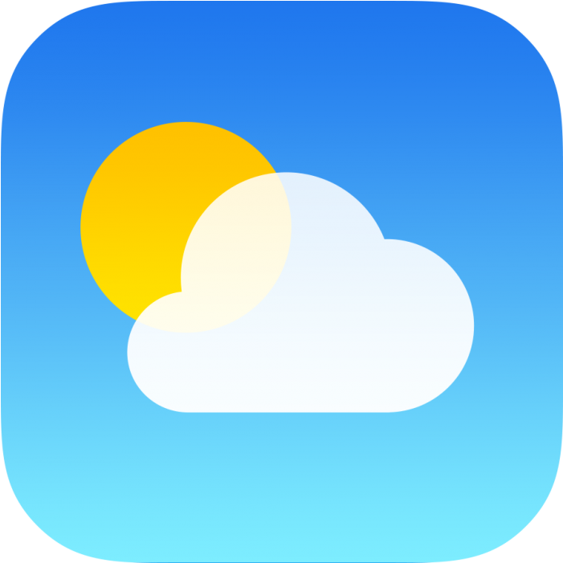
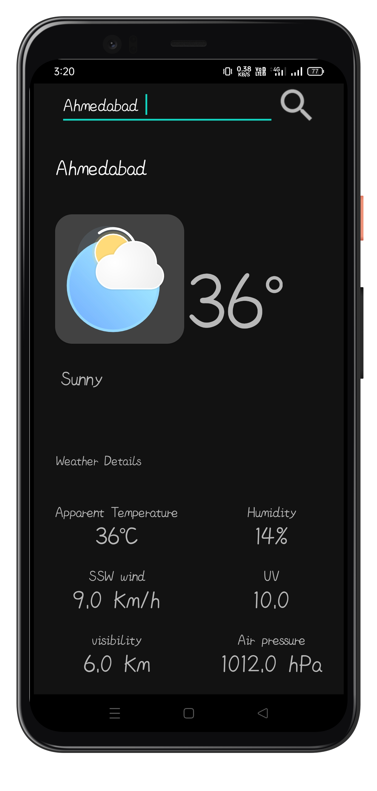
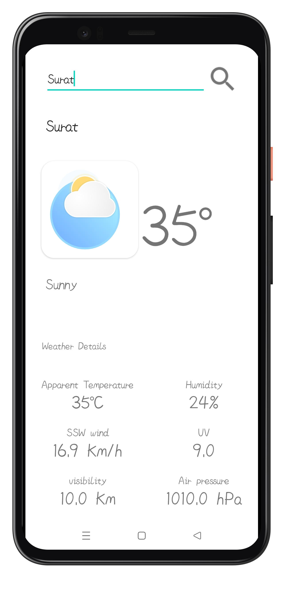

# Weather App
  
A Weather Android Application which shows the Weather details According to
the City.

# Screenshots:
 

# Features:

* Different weather animations are added according to  weather conditions using Lottie-files.

# Download
